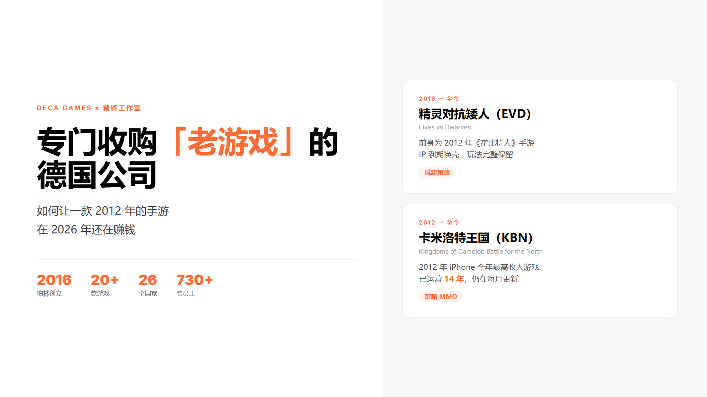
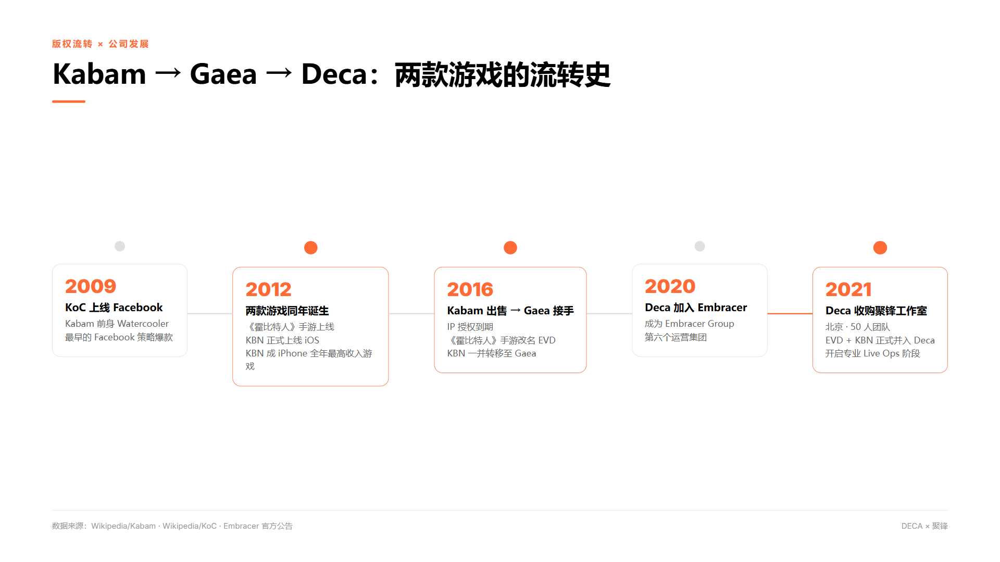
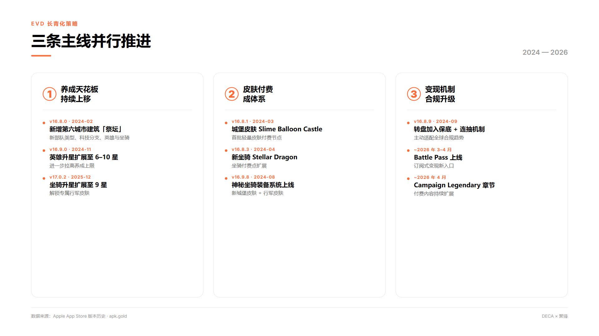
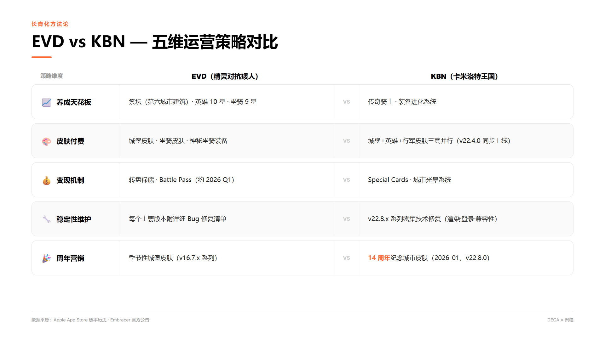

# 专门收购"濒死老游戏"的德国公司，如何让2012年的手游在2026年还赚钱

---

## 引子

一款2012年上线的手游，到2026年还在每月更新——这不是情怀，是经过设计的商业模式。

Deca Games是一家你可能从未听说过的德国公司，但你手机里可能装过它们旗下的游戏。他们的打法很反直觉：不开发新爆款，专门收购那些被大厂"遗弃"、慢慢衰退的老游戏，再用专业运营团队把它们养活。

这篇文章聚焦Deca旗下两款手游：《精灵对抗矮人》（EVD）和《卡米洛特王国：北征》（KBN）。从版权流转的曲折历史，到2024-2026年具体的运营动作，带你看清一种在国内几乎没人在做的游戏商业模式。

---

## 一、Deca与聚锋：一家德国公司和一支北京团队

2016年，前Kabam欧洲总部总经理Ken Go在柏林注册了Deca Games。Kabam是当年Facebook游戏时代的明星公司，Ken Go在Kabam期间曾出任《卡米洛特王国》执行制作人——这个细节在后面会变得有趣。

Ken Go创立Deca的逻辑是：大型游戏公司为了追逐下一款爆款，会渐渐放弃手里那些"老而不死"的游戏，这些游戏有稳定的忠实用户群，但研发资源几乎归零。他要做的，就是把这些游戏买过来，配上全栈运营团队（社区、产品、开发、美术、客服、活动策划），重新把它们养起来。他本人如此描述这门生意的初心：

> "我创立DECA，是为了给开发者提供一条'不关服'的出路，也是为了那些深爱这些濒死游戏的铁杆玩家。"

这个模式有过实证：Deca接手Realm of the Mad God一年后，日活用户翻了一倍。

2020年8月，Deca被Embracer Group收购，成为这家瑞典游戏控股巨头的第六个运营集团。此后18个月，Deca团队从80人扩张到超过230人，游戏组合翻倍至20+款，业务覆盖26个国家。

2021年10月，Deca收购了北京聚锋工作室。聚锋成立于2015年，原属Gaea（游爱），约50人团队，手里有8款全球发行的手游。收购时这8款游戏合计约15万日活、80万月活，季度营收约5000万瑞典克朗——关键在于：99%以上来自亚太区以外的国际市场。这些游戏在国内几乎无人知晓，在海外却有稳定的付费用户群。

Gaea联合创始人兼总裁An An在收购后出任Deca中国办公室董事总经理，原有团队维持独立运营——这是Deca一贯的收购策略：保留人，不空降。

---

## 二、EVD：从《霍比特人》到"精灵对抗矮人"

EVD的前身，是一款授权自《指环王》电影公司的手游。

2012年10月，Kabam联合华纳兄弟互动娱乐推出了《霍比特人：中土王国》（The Hobbit: Kingdoms of Middle-earth），登陆iOS和Android。游戏借着《霍比特人》三部曲电影的IP顺风车，积累了一批城建策略类用户。

2016年初，Kabam开始甩卖遗留资产，将多款老游戏打包出售给Gaea Mobile。Gaea接手后面临一个迫切问题：《霍比特人》IP授权即将到期，游戏必须"换壳"。

Gaea的解法是：保留全部游戏系统、玩法和用户数据，把精灵与矮人的世界观留下，去掉所有托尔金IP元素，重命名为《Elves vs Dwarves》。玩家数据无缝迁移，玩法完全一致。这个操作的关键不在创意，而在执行——用户留存率直接决定了这款游戏能不能活下去。

2021年随聚锋并入Deca体系后，EVD进入更系统化的运营阶段。2024年起，三条策略主线并行推进：

**养成天花板持续上移**：2024年2月新增第六城市建筑"祭坛"；同年11月英雄升星上限扩展至6-10星；2025年底坐骑升星扩展至9星。每次版本都给重度付费玩家设置新的追逐目标。

**皮肤付费体系成型**：从"Slime Balloon Castle"城堡皮肤，到"Stellar Dragon"坐骑，到神秘坐骑装备，外观消费渗透到游戏每一个可视层。

**变现机制合规升级**：2024年9月，转盘引入了保底机制和连抽机制，主动适配全球手游合规趋势；大约2026年3-4月，EVD推出了Battle Pass。

---

## 三、KBN：从Facebook爆款到14年长寿手游

如果说EVD是一匹黑马，KBN曾经是一匹货真价实的白马。

2009年11月，Kabam前身Watercooler在Facebook上线了《卡米洛特王国》（Kingdoms of Camelot），是Facebook策略游戏最早的爆款之一。2012年3月，移动版KBN正式上线iOS，成为Kabam首款移动游戏。

成绩异常耀眼：2012年，KBN成为iPhone全年最高收入游戏，在超过50个国家保持最高收入应用排名。同年Kabam总营收3.6亿美元，KBN领衔的四款游戏合计营收超过1亿美元。

然后是熟悉的剧情：大公司战略转型，老游戏打包清仓。2014年底，页游版KoC卖给RockYou；2016年初，移动版KBN随遗留游戏组合一起卖给Gaea，再到2021年随聚锋并入Deca。

Deca接手KBN时，游戏已经运营将近10年。面对一个几乎不会有新用户涌入的高龄游戏，任务只有一个：让老玩家继续花钱。

打法是系统性铺开付费层：

2024年11月（v22.4.0），KBN一口气上线了城堡皮肤、英雄皮肤系统、行军皮肤、传奇骑士和装备进化系统——五套付费体系同时激活，几乎覆盖了所有可能的付费节点。

2025年11月，新增"特殊卡牌"（Special Cards），引入社交付费机制。

2026年1月，KBN推出"城市光晕系统"和"14周年纪念城市皮肤"。KBN移动版恰好于2012年3月上线，2026年1月刚好是第14年。一款14岁的游戏在庆祝自己的生日，听起来有点荒诞——但情感绑定就是这样运作的：老玩家为游戏的存续感到骄傲，并愿意为这种骄傲付费。

---

## 四、Deca的长青化方法论：三个核心点

把两款游戏的运营轨迹放在一起看，可以提炼出三个共性策略：

**1. 养成天花板是续命药，不是鸡血**
英雄星级、坐骑星级、城市建筑层级、装备进化——每一次上移，都在给重度付费玩家设置新的可追逐目标。延长的不是游戏寿命，而是付费周期：只要天花板还在上升，"氪金满配"就永远是一个未完成的命题。

**2. 皮肤体系构建稳定收入层**
外观付费与养成付费共存，覆盖两类付费意愿：愿意为强度花钱的重度玩家，以及愿意为好看花钱的轻度玩家。Deca在EVD和KBN上都完整铺开了双轨付费结构，两类用户都不放过。

**3. 变现机制跟着全球合规趋势走**
Wheel的保底改造、Battle Pass的引入，不是闲来无事的创新，而是对全球手游监管趋势（保底公示、概率透明化）的主动适配。合规让游戏能在更多地区持续上架，降低被迫关服的风险。

---

## 结语

Deca的存在，提醒我们游戏市场里有一个长期被低估的命题：一款有情感积累的老游戏，对于忠实用户来说，价值未必低于一款新游的首月流水。

问题留给你：这套"收购老游戏、长期运营"的模式，在国内有没有可能出现？你觉得哪款国产老游戏最值得被这样"救活"？

---

> 本文所有数据均来自公开一手来源（Embracer官方公告、维基百科、Apple App Store版本历史、PR Newswire等），不含未经证实信息。
