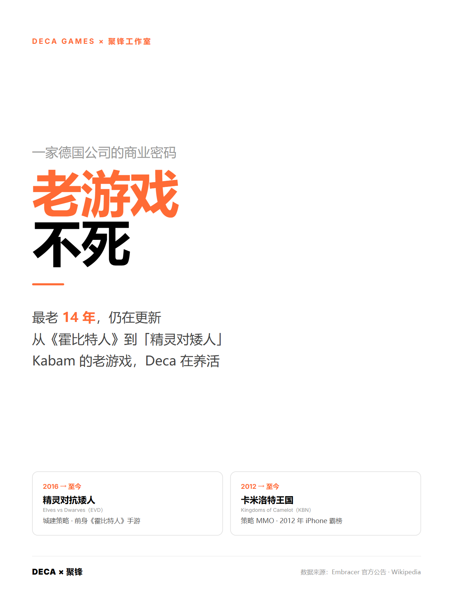
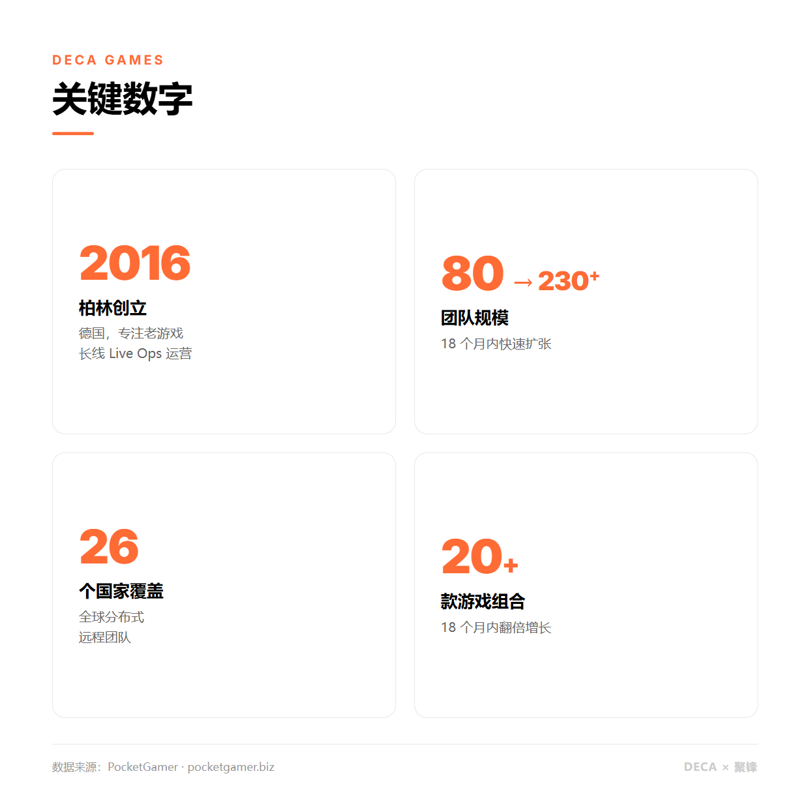
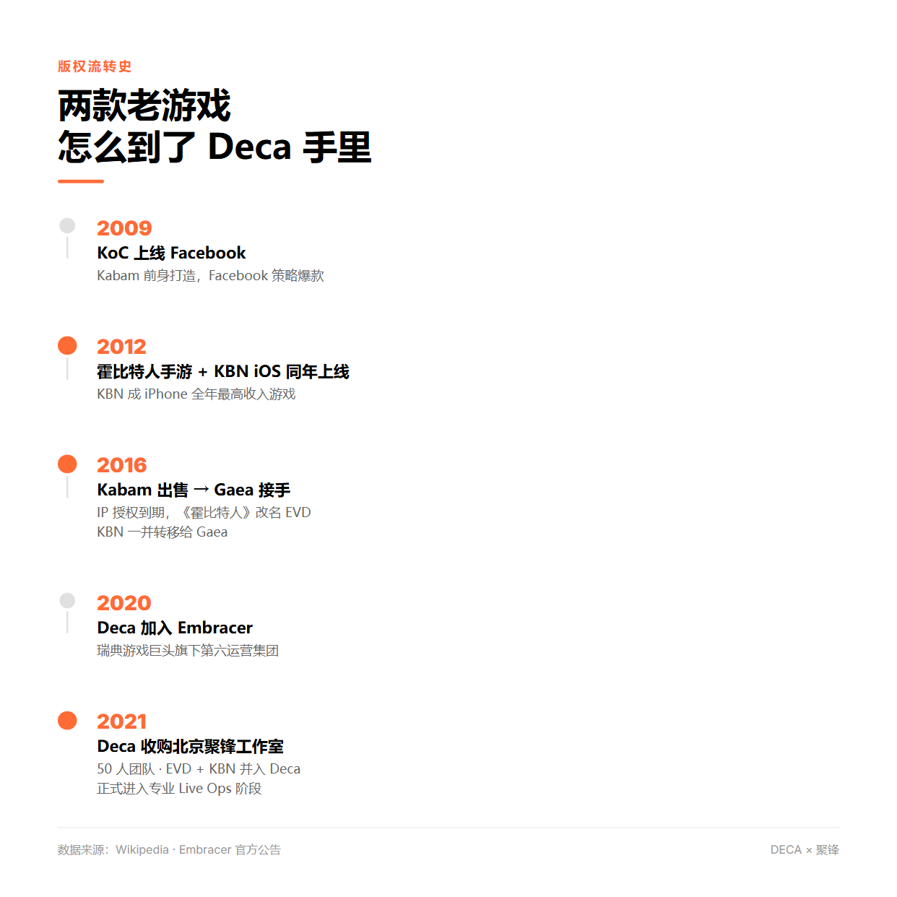
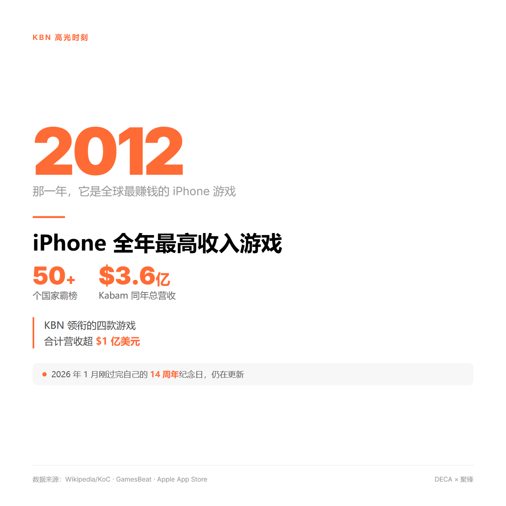
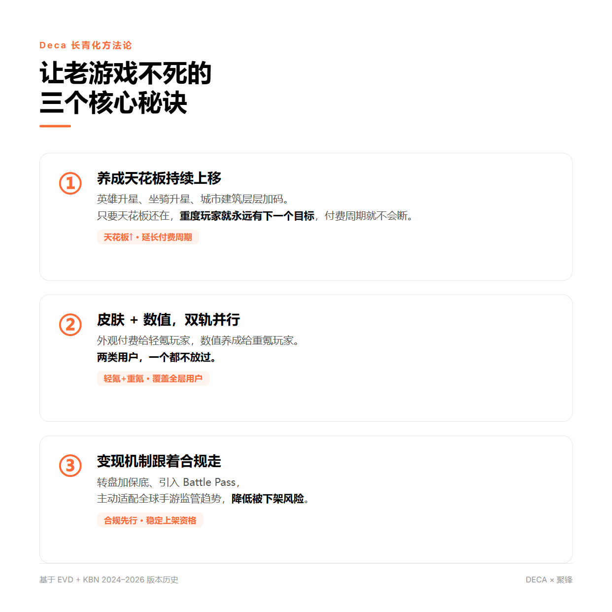
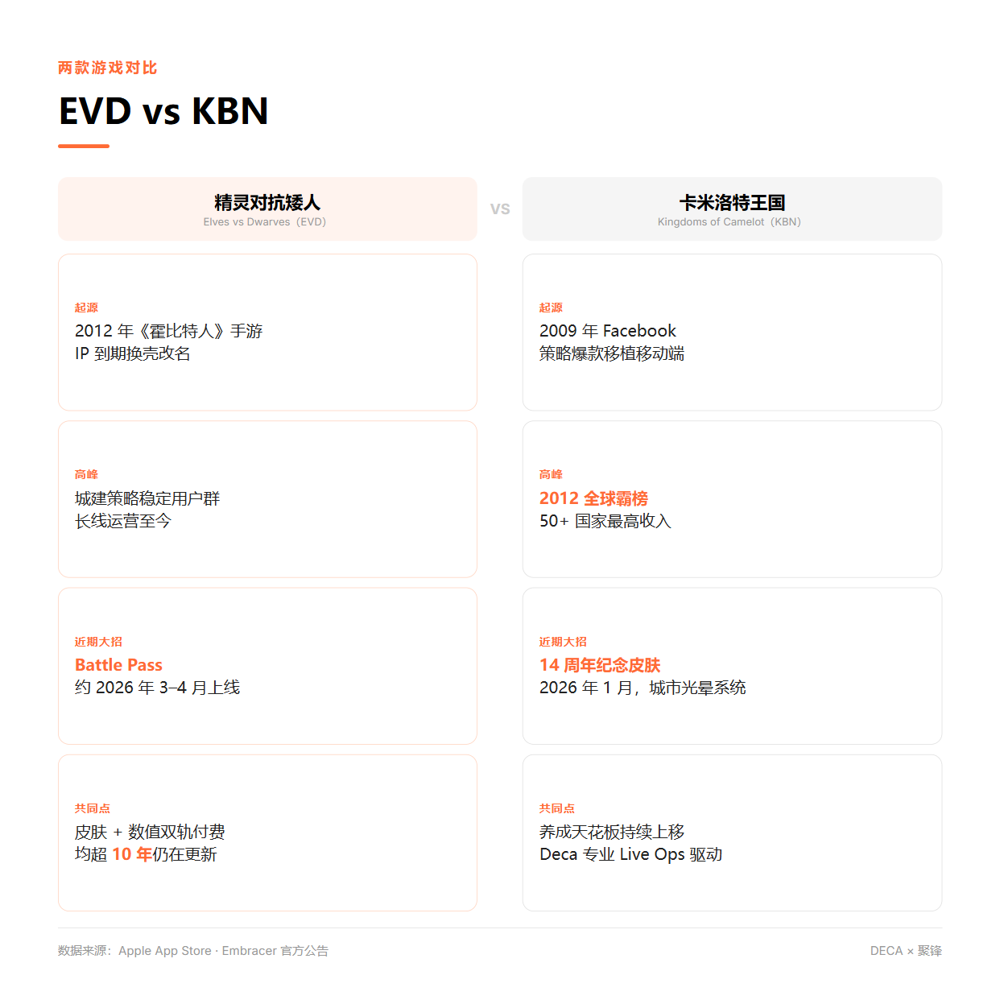

# 🎮 一家德国公司专门"收购濒死老游戏"，这门生意有多稳？

---

有没有一款手游，你以为它早就关服了，结果发现它还在更新？
背后可能是同一家公司——Deca Games，专门把老游戏"救活"的德国公司，北京还有个50人的研发团队。

---

---

**【这家德国公司专门收购老游戏】**

2016年，前Kabam高管Ken Go在柏林创立Deca Games：大厂为了新游会放弃老游戏，但老游戏还有忠实用户——买下来，配专业运营团队持续养着，就是一门稳定生意。

2020年Deca被瑞典游戏巨头Embracer收购；2021年又收购了北京聚锋工作室：50人团队，8款海外手游，15万日活，99%以上收入来自国际市场。这些游戏国内没人知道，海外玩家还在老老实实充钱。

---

**【你可能玩过的两款老手游】**

聚锋旗下最有代表性的两款：

《精灵对抗矮人》（EVD）——前身是2012年Kabam与华纳联合做的《霍比特人》手游，IP到期后换壳保留玩法，改名活到今天，2026年还在出新内容。

《卡米洛特王国：北征》（KBN）——2012年曾是iPhone全年最高收入游戏，50多个国家霸榜。几经转手落到Deca手里，2026年1月刚过完14周年纪念，还出了限定皮肤。

两款都超过10年历史，2024-2026年仍在密集更新：新建筑、新皮肤、新坐骑、Battle Pass……

---

**【他们的运营秘诀】**

三个核心动作：

① **养成天花板持续上移** — 英雄升星、坐骑升星、城市建筑层层加码。只要天花板还在，重度玩家就有东西可追，付费周期就不会断。

② **皮肤付费和强度付费双轨并行** — 外观给轻氪玩家，数值给重氪玩家，两头都不放过。

③ **变现机制跟着全球合规走** — 转盘加保底、引入Battle Pass，适配监管趋势，减少被下架风险。

核心逻辑：不靠新用户，靠老用户的持续忠诚。

---

你有没有"以为早死了结果还在更新"的手游经历？

国内哪款老手游最值得被这样救活？评论区聊聊 👀

---

#游戏运营 #商业故事 #手游 #长青游戏 #海外公司
